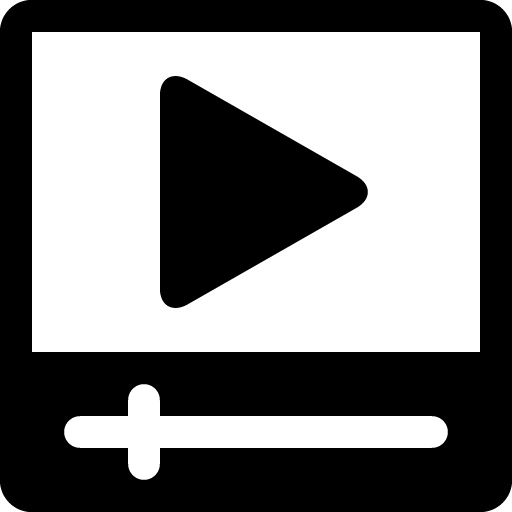

# **Advanced Lane Detection**

![alt text][image10]

In this project I detect lane lines using advance computer vision techniques. This project is part of the *Udacity Self Driving Car Nanodegree* (see: https://www.udacity.com/drive ). 

In this project I implement the following steps:

* Compute the camera calibration matrix and distortion coefficients given a set of chessboard images.
* Apply a distortion correction to raw images.
* Use color transforms, gradients, etc., to create a thresholded binary image.
* Apply a perspective transform to rectify binary image ("birds-eye view").
* Detect lane pixels and fit to find the lane boundary.
* Determine the curvature of the lane and vehicle position with respect to center.
* Warp the detected lane boundaries back onto the original image.
* Output visual display of the lane boundaries and numerical estimation of lane curvature and vehicle position.

## Final Video
Here's a <a href="./processed_video.mp4"></a> [link to my video result](./processed_video.mp4) in case you just can't wait :).
The **system can track the lane lines as they swerve in different directions** and it can deal with the car moving from left to right and with changes in scenery. 

## Code 
The following is the various parts of the code :
* Main Processing pipeline: https://github.com/railsnoob/Advanced-Lane-Lines-Finding/blob/master/processing.py (This needs some refactoring :)
* Movie creation and lane smoothing : https://github.com/railsnoob/Advanced-Lane-Lines-Finding/blob/master/movie.py


[//]: # (Image References)

[image1]: ./output_images/test1_unsdist.jpg "Undistorted"
[image2]: ./test_images/test1.jpg "Road Transformed"
[image3]: ./output_images/th_pipeline.png "Binary Example"
[image4]: ./output_images/pre-warped-straight.png "Warp Example"
[image5]: ./output_images/lines_color_fit.png "Fit Visual"
[image6]: ./output_images/test1_result.jpg "Output"
[image8]: ./output_images/warped_straight.png "Output"
[image9]: ./movie-4.png "Movie Icon"
[image10]: ./vlcsnap-2017-06-23-10h02m04s71.png
[video1]: ./project_video.mp4 "Video"


## Camera Calibration

#### 1. How I computed the camera matrix and distortion coefficients. I provide an example of a distortion corrected calibration image.

The code for this step is contained in lines 398 through 411 of the file called `processing.py`).  

I start by preparing "object points", which will be the (x, y, z) coordinates of the chessboard corners in the world. Here I am assuming the chessboard is fixed on the (x, y) plane at z=0, such that the object points are the same for each calibration image.  Thus, `objp` is just a replicated array of coordinates, and `objpoints` will be appended with a copy of it every time I successfully detect all chessboard corners in a test image.  `imgpoints` will be appended with the (x, y) pixel position of each of the corners in the image plane with each successful chessboard detection.  

I then used the output `objpoints` and `imgpoints` to compute the camera calibration and distortion coefficients using the `cv2.calibrateCamera()` function.  I applied this distortion correction to the test image using the `cv2.undistort()` function and obtained this result: 

![alt text][image1]

## Image Pipeline (single images)

#### 1. An example of a distortion-corrected image (contrast with above - look at where the position of white car).
To demonstrate this step, I will describe how I apply the distortion correction to one of the test images like this one:

![alt text][image2]

#### 2. How I you used color transforms, gradients  to create a thresholded binary image, with examples.
I used a combination of color and gradient thresholds to generate a binary image (thresholding steps at lines 108 through 130 in `processing.py`).  Here's an example of my output for this step.  

![alt text][image3]

#### 3. How I performed a perspective transform to see the lane lines from above.

The code for my perspective transform includes a function called `get_transformed()`, which appears in lines 42 through 62 in the file `processing.py` (processing.py).  The `get_transformed()` function takes as inputs an image (`img`), as well as img_size.  I chose the hardcode the source and destination points in the following manner:

CROP_Y=410

```
    perspective = np.array([[294,665-CROP_Y],[1014,665-CROP_Y],[710,465-CROP_Y],[576,465-CROP_Y]],dtype="float32")
    noperspective = np.array([[400,665-CROP_Y],[1100,665-CROP_Y],[1100,465-CROP_Y],[400,465-CROP_Y]],dtype="float32")

```
This resulted in the following source and destination points:

| Source        | Destination   | 
|:-------------:|:-------------:| 
| 294, 245      | 400, 245      | 
| 1014, 245     | 1100, 245      |
| 710, 55      | 1100, 55      |
| 576, 55      | 400, 55        |

I verified that my perspective transform was working as expected by drawing the `src` and `dst` points onto a test image and its warped counterpart to verify that the lines appear parallel in the warped image.


![alt text][image4]

![alt text][image8]

#### 4. How I identified lane-line pixels and fit their positions with a polynomial.

Then I fit my lane lines with a 2nd order polynomial like this:

![alt text][image5]

#### 5. How I calculated the radius of curvature of the lane and the position of the vehicle with respect to center.

Essentially after finding the lane-line pixels I mapped the warped image back to real life coordinates. And then I estimated the number of real world meters for every pixel in both x and y co-ordinates. I then use this to calculate the curvature in the left and right lane lines.

I did this in lines 267 through 315 in my code in `processing.py`

#### 6. Plotting my calculated lane back down onto the road such that the lane area is identified clearly.

I implemented this step in lines 267 through 315 in my code in `processing.py` in the function `draw_wrap_image()`.  Here is an example of my result on a test image:

![alt text][image10]

---

## Pipeline (video)

#### 1. Link to my final Video showing my system working in real time.

Here's a [link to my video result](./processed_video.mp4)

---

## Discussion

#### 1. What are the possible causes of failure of the system as it is and what can we do to make it more robust? 

Possible causes of failure:
1. If the contrast of the lane lines declines to the point where it essentially disappears, this algorithm would not work. For example in cases where the sun is not quite setting and the lines are faint. 
2. When there is snow on the ground, this will confuse the algorithm. 

To make it more robust: 
1. We should remember the position of lines that have been correctly located and extrapolate them and use that in our calculations with a time based decay. 
2. Work on using other parts of the road - example highway dividers etc as secondary guides. 
3. In the future we could also add information from other cars which have passed through the same lane lines using an accurate GPS reading for reference. 
